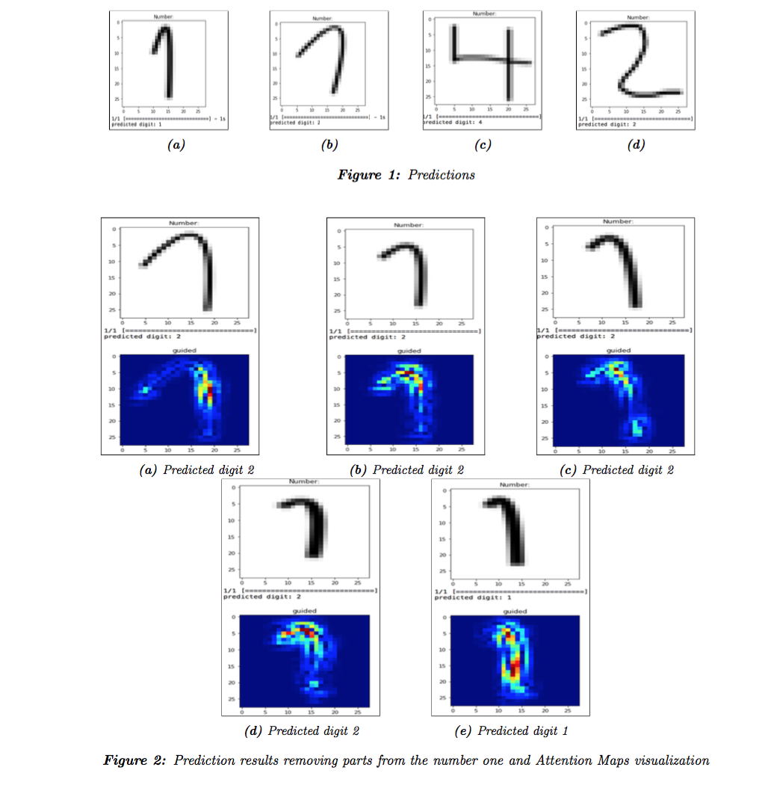

# lelec2885

In this project the team has studied theoretically and practically a type of **Neural Networks** especially used for images applications: **Convolutional Neural Networks**.

Convolution Neural Networks are similar to ordinary Neural networks, but they take advantages that the input layer consists on images and its can be the full image with the larger size compared with regular networks. In fact, the image of the regular network can only of size 32*32*3 which corresponds to width, height and color channel. If we take the image with larger size, overfitting would happened, because it would contain more parameters than can be justified by the data, leading to poor performance.

Actually, there are three main layers in CNN: Convolution layer, Pooling layer (Max pooling) and Fully connected Layer. The convolution layer is the main layer in CNN, including the parameter ’filter’ which is actually the smaller number, but with the same number of depth with input image. Inside the convolution layer, the filter scan over or convolve every pixel and computing the dot product. Pooling layer would be our second layer and it is used to conduct downsampling operations inside which reducing the size of the image, that can be more easy to control the ’overfitting’ issue. The most common one is max pooling, it use the 2*2 filter with stride=2 to keep the maximum value of the image. The final layer goes to Fully connected layer that computing the class scores, and reduce the full image to the single vector of class scores.

To implement practically our CNN, we are going to resort to Keras library. Keras is a high-level neural networks API, written in Python and capable of running on top of TensorFlow, CNTK, or Theano[1].

## Model Implementation

In this section a explanation of the choices done to implement the CNN is given. The  python code ca be found in [CNN.py](code/CNN.py).

First of all a 2D convolutional layer is implemented which is set up to take 32 windows, or ’filters’, of each image, each filter being 3x3 in size. Then a second convolution is run on top of that with 64 3x3 windows. This topology is just what comes recommended within Keras’s own examples [1].

Next  a MaxPooling2D layer is applied that takes the maximum of each 2x2 result to distill the results down into something more manageable. A dropout filter is then applied to prevent or to avoid overfitting. It consists of setting to zero the output of each hidden neuron with the probability given. The neurons which are ’dropped out’ in this way do not contribute to the forward pass and do not participate in backpropagation [5].

Next the team flatten the 2D layer  obtained at this stage into a 1D layer. Then feed that into a hidden, flat layer of 128 units. Then a dropout is applied again to further prevent overfitting. And finally,  feed that into our final 10 units where softmax is applied to choose our category of 0-9.

In this paragraph the two main argument in the Keras Model ,optimizer and loss function, are induced. Firstly, regarding the optimizer, it is about to optimize the model weight and reduce the cost function and are based based on Gradient descent (GD). There are several type of optimizer that we can choose, such as SGD which is Stochastic gradient descent optimizer, in order words random GD, and RMSprop, Adagrad, Adam ,etc We chose Adam because it is straightforward, efficient and only consume little memory.

The second argument is Loss Function, it is used to estimate the difference between predicted value and true value, named y pred and y true. There are also numerous types of loss function that we can choose. For this project, the team chose categorical crossentropy because it expects a binary class, that what our image perform.

The **accuracy** obtained was **0.9922**

Finally a script ([test handwritten.py](code/test_handwritten.py)) was developed in order to try our trained model with handwritten numbers. 

## Study CNN behavior: one vs two

In this part we are going to study thoroughly the decisions made by the CNN trained. For doing this research we are going to focus on the numbers one and two, because we could appreciate some interested results. The code is implement in [visualization.py](code/visualization.py)

First of all we draw both numbers similar to the MINISTs ones so that the CNN predicts perfectly each number (Figure 1a and 1d ) .
After that we study the behavior of the CNN during the predictions. For doing that we used Keras-vis [4], a Neural Network visualization toolkit for Keras, in order to represent the Attention Maps.

This technique uses the gradients, between the output and input, to highlight input regions that cause the most change in the output. In order words the most important parts of the image for the predictions will be the ones with higher values of gradient. Hence we have performed a test removing parts of the number one to visualize how the predictions changed. The results of the predictions made by the model are shown in figures Figure 2a to Figure 2e.

With this approach we could noticed that the most important part for the CNN to distinguish between one and two is principally the upper part of the number. The main reason is that the ones from MINISTs dataset used to train the model did not have this upper part. With a big ’head’ it is only enough the left extreme to predict a number two (Figure 2a), but while we are reducing this part, it is needed to check the whole part(see Figure 2b, Figure 2c and Figure 2d). Finally, until the CNN does not interpret this part as a continuous prolongation of the body (Figure 2e), it does not predict the number properly.

## Images

## References

[1] Keras documentation:
   https://keras.io/

[2] Keras Tutorial: The Ultimate Beginner ́s Guide to Deep Learning in Python
   https://elitedatascience.com/keras-tutorial-deep-learning-in-python

[3] Udemy platform: Data Science, Deep Learning, & Machine Learning with Python
   https://www.udemy.com/data-science-and-machine-learning

[4] Neural network visualization toolkit for keras
   https://github.com/raghakot/keras-vis

[5] A. Krizhevsky, I. Sutskever, and G. E. Hinton. ImageNet Classification with Deep Convolutional Neural Networks

[6] Maxime Oquab, Leon Bottou, Ivan Laptev, Josef Sivic1. Learning and Transferring Mid-Level Image Representations using Convolutional Neural Networks

[7] Transfer learning & The art of using Pre-trained Models in Deep Learning
   https://www.analyticsvidhya.com/blog/2017/06/transfer-learning

[8] Li, Zhizhong; Hoiem, Derek; ”Learning without Forgetting”, European Conference on Computer Vision (pp. 614-629), 2016